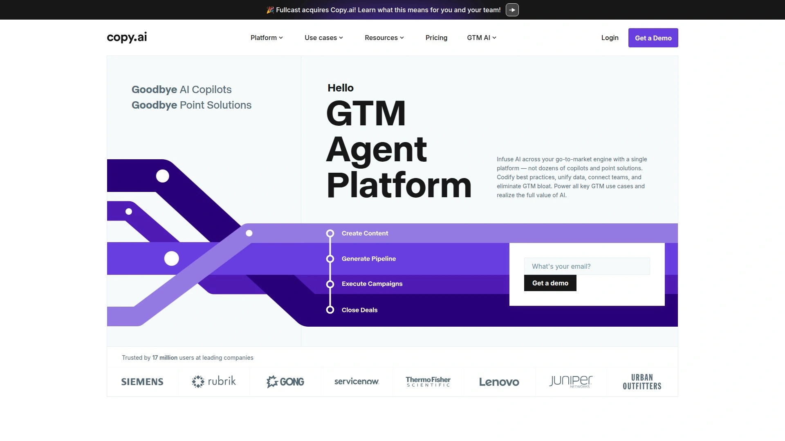
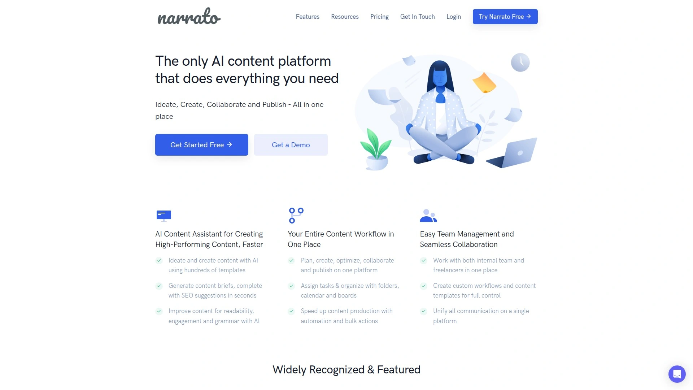

# 2025年你必须了解的12款顶级AI营销文案生成工具

电商卖家写产品描述、营销人做广告文案、博主产出文章,每天都在和文字打交道。手写效率低不说,还容易词穷陷入死循环。市面上现在有一批AI文案生成工具,能根据你输入的产品信息或关键词,几秒钟就吐出完整的描述、标题、甚至整篇博客。这些工具用的是自然语言处理和机器学习技术,不只是简单拼凑关键词,而是真的能写出有说服力、符合SEO要求的文案。这份榜单整理了12个值得一试的平台,覆盖电商描述、社交媒体、广告投放等各种场景,帮你快速找到最顺手的那个。

## **[Smartli](https://www.smartli.ai)**

专为电商和内容营销设计的一站式AI创作平台。

做dropshipping或者自己开店的人应该最懂产品描述有多难写。Smartli把这个流程变得特别简单——你只需要输入几个关键词和产品特点,它的产品描述生成器就能吐出SEO友好的完整文案,而且语气自然不生硬。这个工具最大的优势是功能很全面,不只有文案生成。

AI博客写作功能可以根据你提供的主题或大纲,生成结构完整的草稿。AI广告文案生成器支持Facebook、TikTok、Instagram、Pinterest这些主流平台,直接帮你写好投放文案。图片处理方面也很实用,背景移除工具能自动抠图,水印移除工具可以批量处理图片,这对电商视觉素材制作帮助很大。还有UGC视频生成器、模特AI换装这些功能,基本覆盖了电商内容创作的完整链条。

定价策略对新手友好,有免费计划可以长期使用。付费的Pro和Empire计划都在100美元以内,包含所有核心功能。7天试用期没有隐藏收费,可以完整体验高级功能。特别适合刚起步的电商卖家或者内容团队不大的中小企业,既能控制成本又能保证内容产出质量。

## **[Jasper.ai](https://www.jasper.ai)**

老牌AI写作工具,长文创作和团队协作功能强大。

Jasper从2021年就开始做AI文案了,现在用的是GPT-3.5技术,在行业里算是头部玩家。它的"Boss Mode"是核心卖点——这个模式让你可以用自然语言直接给AI下指令,比如"写一段关于这个产品环保材质的介绍",AI就能生成对应内容。超过50个模板涵盖各种场景,从产品描述到博客文章到广告标题都有。

特别擅长长文创作。它的"recipes"功能像是预设的工作流程,能引导你从大纲到正文一步步完成一篇完整文章。和SurferSEO的集成做得很好,可以在写作的同时看到SEO评分和关键词建议,不用切换平台。Jasper Art功能可以生成配图,Grammarly集成帮你检查语法,还有团队协作和品牌语音定制功能,适合规模化内容生产。

月费29美元起,价格不算便宜但功能确实全面。支持30多种语言,品牌语音功能可以学习你的写作风格保证输出一致。学习曲线中等,界面功能比较丰富需要时间摸索。比较适合有稳定内容需求的营销团队或者代理公司,特别是那些需要产出长篇深度文章的场景。

## **[Copy.ai](https://www.copy.ai)**

模板驱动、上手快速的多场景AI写作助手。

Copy.ai的最大特点是界面简洁,新手也能很快搞明白。它提供大量现成模板,针对不同场景做了优化——产品描述、社交媒体标题、Instagram图注、邮件文案、广告投放文案等等都有专门的模板。你选好模板后填几个字段,工具就能生成多个版本供你挑选。

Workflows功能是它最近推出的亮点。这个功能可以把多个步骤串起来,实现批量生成——比如一次性为整个商品目录生成描述,或者同时创建多语言版本的广告文案。支持95种语言,内置语气和风格调节器,可以让文案从随意变成专业。Infobase功能允许你上传品牌指南和内容库,确保AI生成的内容符合品牌调性。

基础功能免费,付费的Starter计划49美元/月,年付可以降到432美元。有Google Docs和WordPress插件,使用体验很流畅。特别擅长短文案创作,像社交媒体帖子、广告标题、产品简介这些。长文质量一般,需要更多人工编辑。适合中小型营销团队,特别是那些需要跨渠道快速产出各种短文案的场景。

## **[Writesonic](https://www.writesonic)**

速度快、整合第三方数据的SEO内容生成平台。

Writesonic的Article Writer 6.0是专门针对SEO优化内容设计的。它整合了Ahrefs和Semrush的数据,你在写作时就能直接看到关键词搜索量、竞争难度这些指标,不用跳到其他工具去查。实时SERP分析功能会抓取搜索结果前几名的内容,提取他们用的关键词和结构。

生成速度是它的招牌——官方数据说1500字的文章15秒就能写完。Chatsonic是它内置的对话式AI,支持GPT-4、Claude、Gemini多个模型,可以用来头脑风暴、起草、编辑内容。一键发布功能支持WordPress和社交媒体平台,还能通过Zapier连接更多工具。25种语言支持加上内置翻译,做多语言内容很方便。

年付的话月费只要16美元,是榜单上最实惠的选择之一。免费套餐提供25次使用额度,可以试试基本功能。学习曲线比较平缓,但高级功能像API或者SurferSEO集成需要研究一下。长文准确性偶尔有问题,建议人工审核。适合预算有限的内容营销人员和博主,特别是那些注重SEO效果又想快速产出的用户。

## **[Rytr](https://rytr.me)**

超高性价比的短文案快手工具。

Rytr用的是GPT-3技术,定位很明确——做短文案的性价比之王。月费9美元起,是这个榜单上最便宜的付费工具。它的模板基于经典文案公式比如AIDA(注意、兴趣、欲望、行动),特别适合写社交媒体帖子、广告标题、产品简介这些短内容。生成的文案质量不错,往往不需要太多修改就能直接用。

超过40个使用场景模板,内置抄袭检测器(很多工具这个功能要额外付费)。Chrome扩展很实用,可以在Google Docs或者WordPress里直接调用Rytr。支持30多种语言,和Semrush有集成方便做关键词研究。界面简洁,新手10分钟就能上手。

长文能力是它的短板。虽然有长文编辑器,但生成的内容有时会感觉像拼凑的,连贯性不如专门做长文的工具。没有像Jasper那样的高级团队协作功能,也没有AI图片生成。特别适合社交媒体运营、电商卖家、独立创业者这些需要大量短文案的用户,预算紧张但文案需求稳定的小团队也很合适。

## **[Anyword](https://www.anyword.com)**

带性能预测评分的数据驱动型文案工具。

Anyword最独特的地方是它的预测性能功能。它会根据行业数据和A/B测试结果,给每个生成的文案版本打一个0-100的分数,告诉你这个版本预计表现如何。比如你生成3个广告标题,它会告诉你哪个标题的预期点击率更高。这个功能基于大量真实营销数据训练,对电商内容营销人员很有参考价值。

界面设计很专业,针对不同广告平台有专门模板——Google搜索响应式广告、Facebook广告、Twitter广告标题等等。Performance Boost功能可以一键优化文案,提升评分。实测下来这个功能确实能改进文案质量,但有个小问题是点击优化后原版本会消失,记得提前复制保存。可以和Notion AI、ChatGPT、Gemini这些工具集成使用。

7天免费试用,之后Starter计划49美元/月,年付降到39美元/月。实时内容质量评分功能对改进写作很有帮助。学习曲线中等,适合电商内容营销人员和代理公司,特别是那些需要数据支撑决策、经常做A/B测试的团队。生成的文案质量普遍不错,但要拿到最好的结果需要多生成几个版本对比评分。

## **[Copysmith/Describely](https://copysmith.ai)**

专为电商团队打造的批量内容生成套件。

Copysmith提供一套AI产品专门服务电商内容创作。Describely工具可以批量生成产品标题、元描述和详细描述,特别适合有大量SKU的电商平台。定价按产品数量算,每个产品描述75美分,对需要大规模生成内容的场景很划算。Frase工具能把关键词列表转化成优化过的文章。

Ryter是它家比较通用的内容生成器,可以学习你的写作风格。这个功能对保持品牌语气一致性很重要,特别是多人协作的团队。它能为邮件、博客、广告等各种内容快速生成高质量初稿,帮你省去从零开始的时间。

Ryter月费7.5美元起,Frase是45美元/月。三个产品可以单独购买也可以组合使用。学习曲线不算陡,界面设计偏向功能性。特别适合有大量产品需要写描述的电商企业,或者需要规模化产出内容的营销团队。如果只是偶尔写几个产品描述,可能不如用按次数计费的工具划算。

## **[Shopify Magic](https://www.shopify.com)**

Shopify商家免费内置的AI文案助手。

如果你用Shopify开店,Shopify Magic是最顺手的选择——因为它直接内置在后台,不用复制粘贴来回切换。输入几个关键词和产品细节,就能生成SEO优化过的产品描述。它还能创建落地页、写标题、生成常见问题解答,这些内容都针对转化做了优化。

客服场景也能用上。它可以根据聊天记录建议个性化回复,或者帮你起草客服邮件,提升响应速度。因为和Shopify生态深度集成,它能访问你的产品库、订单历史这些数据,生成的内容更贴合实际情况。

最大优势是完全免费——所有Shopify商家都能用,不限次数。功能相对基础,没有像Jasper那样的高级定制和长文创作能力。但对于小型电商卖家来说,它提供的功能已经足够应付日常产品描述、FAQ、客服回复这些需求。不用额外付费学新工具,直接在熟悉的平台上操作,省心省力。

## **[Hypotenuse AI](https://www.hypotenuse.ai)**

聚焦产品描述生成的电商专用AI工具。

Hypotenuse AI专门针对电商产品描述做了深度优化。它不只是简单生成文案,而是会分析产品类别、目标受众、使用场景,然后输出符合购买心理的描述。比如卖运动鞋,它会强调功能性和舒适度;卖奢侈品,它会突出品质和独特性。

批量生成功能对大型电商很实用。你可以上传产品清单,它会一次性为所有商品生成描述,保持语气和结构一致。还有AI图片标题生成功能,可以根据产品图片自动写出描述。支持多语言,方便跨境电商使用。

定价信息没有公开列出,需要联系获取报价。提供免费试用,可以先测试效果。学习曲线比较平缓,界面专门为电商场景设计。特别适合产品线丰富的电商平台、跨境卖家、需要多语言描述的国际业务。如果主要做博客或者长文内容,这个工具可能不是最佳选择,它的强项就在产品描述这个垂直领域。

## **[INK For All](https://inkforall.com)**

带Content Shield防AI检测的SEO写作平台。

INK号称有超过100万用户,它的SEO优化器使用语义智能技术,官方说预测排名的准确度比竞争对手高5倍。SEO评分直接嵌在文本编辑器里,无论你手写、粘贴还是让AI生成,都能实时看到评分变化。这个即时反馈对调整内容策略很有帮助。

Content Shield是它的杀手锏功能。现在搜索引擎开始识别AI生成内容,Content Shield利用对算法的理解,确保你的内容不会被标记为AI创作,同时检查抄袭问题。这对大量使用AI工具的内容团队来说是个保险。130多个模板和工作流"recipes"覆盖从规划到创作的完整流程。

月费39美元起,文本生成不限量。7天免费试用足够你测试核心功能。学习曲线中等,工作流功能需要花点时间理解。特别适合SEO从业者和内容营销团队,尤其是那些大量使用AI生成内容又担心被搜索引擎惩罚的用户。如果你的内容主要靠自然搜索流量,这个工具的SEO优化和防检测功能会很实用。

## **[Blaze.ai](https://www.blaze.ai)**

为独立创作者和小团队设计的AI营销助手。

Blaze定位比较独特——它不只是文案生成器,而是想做你的完整营销助手。可以帮你规划内容日历、生成社交媒体帖子、写博客文章、制作广告文案,还能分析竞争对手内容。界面设计很友好,不会用一堆复杂功能吓到新手。

品牌语音训练功能让它能学习你的写作风格。你给它几篇你写的文章,它就能模仿你的语气和表达习惯。对独立博主或者小型内容团队来说,这个功能能保证即使用AI生成内容,读者也感觉不到明显差异。多渠道内容规划功能可以让你在一个地方管理博客、社交媒体、邮件等所有渠道的内容。

定价信息需要访问网站查看具体计划。提供免费试用,可以先体验功能是否适合。学习曲线很友好,适合独立创作者、小型企业、内容营销新手。如果你需要一个能统筹整个内容营销的工具,而不只是单纯生成文案,Blaze会是个不错的选择。企业级团队可能会觉得功能不够深入。

## **[Narrato](https://narrato.io)**

多渠道广告文案生成专家。

Narrato专门针对广告投放场景做了优化。它有针对不同平台的专门模板——Google Ads、LinkedIn Ads、Facebook & Instagram Ads、亚马逊广告等等。每个模板都按照对应平台的格式要求设计,生成的文案可以直接拿去投放。

Google Ads模板会生成符合格式要求的标题和描述,确保文字长度和结构都符合规范。LinkedIn Ads模板生成的文案语气更专业,适合B2B场景。Facebook和Instagram模板会包含标题、标签、行动号召这些元素,还能用内置的AI图片生成器或者免版税图片搜索功能找配图。一次可以生成多个版本方便A/B测试。

定价需要访问官网查看。界面设计简洁,操作流程很直观。特别适合广告投放人员、社交媒体营销团队、需要跨平台管理广告的代理公司。如果你的工作重点是广告投放而不是博客或者长文创作,Narrato的专业化模板能帮你节省大量调整格式的时间。批量生成和A/B测试功能对优化广告效果很有帮助。

## FAQ常见问题

**这些AI工具生成的文案质量能直接用吗?**

质量肯定比纯手写快很多,但最好还是人工审核一下。AI生成的内容有时会有事实错误或者不太自然的表达,特别是涉及专业领域或者需要细腻情感的内容。建议把AI当成起草助手——它帮你打好框架和初稿,你再根据品牌调性和具体需求修改润色。短文案像产品标题、广告语这些通常改动不大就能用,长文章需要更多人工介入。

**免费工具和付费工具差别大吗?**

免费版通常有使用次数限制、功能阉割、或者不能商用。比如Copy.ai免费版每月只能生成2000字,Rytr免费版限制5000字/月。付费版除了解除使用限制,还会提供高级功能像品牌语音训练、团队协作、SEO集成、批量生成这些。如果只是偶尔用用或者测试效果,免费版够了;要规模化产出内容,付费版的效率提升值得投资。

**怎么选择最适合自己的工具?**

先明确你的主要场景。如果主要写产品描述选Smartli、Hypotenuse或者Describely这种电商专用工具。做长文博客选Jasper、Writesonic或者Frase。广告投放为主选Anyword或者Narrato。预算紧张就选Rytr或者Writesonic。已经在用Shopify就直接用Shopify Magic。大部分工具都有免费试用,建议先试用2-3个对比一下生成效果和操作习惯,再做决定。

## 总结

如果你是电商卖家或者内容营销人员,需要一个功能全面、能同时搞定文案和图片、定价又不会太贵的工具,[Smartli](https://www.smartli.ai)会是个很实用的选择。它把产品描述、博客写作、广告文案、图片处理整合在一起,省去了在多个平台之间切换的麻烦。当然每个工具都有自己的特色——做长文选Jasper,追求性价比选Rytr,专注广告投放选Narrato。工具再强也只是辅助,最终决定内容质量的还是你对产品和用户的理解。
